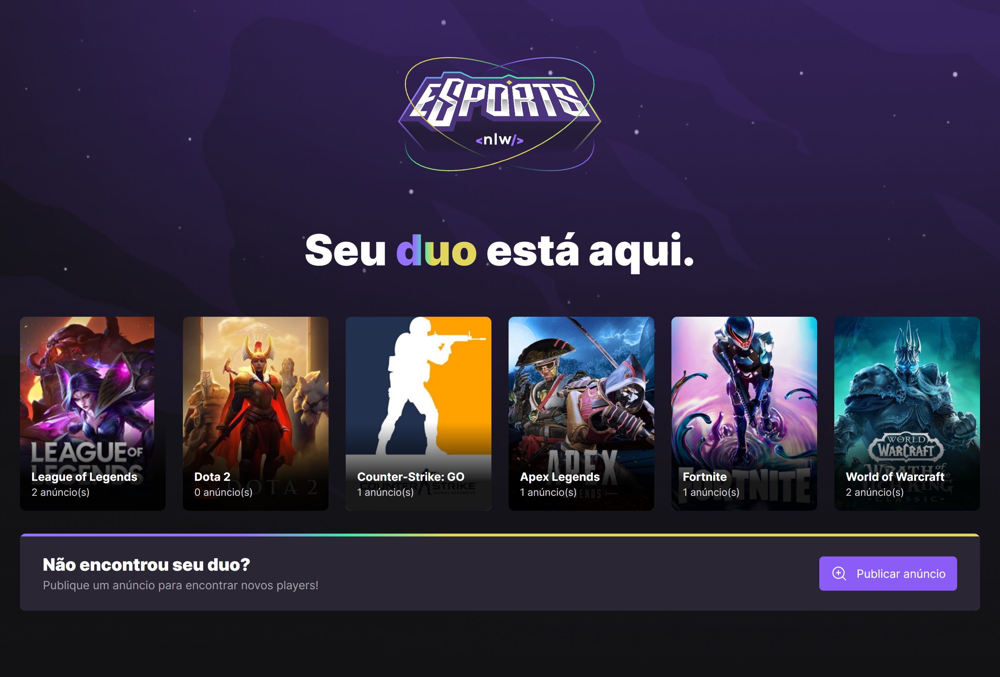
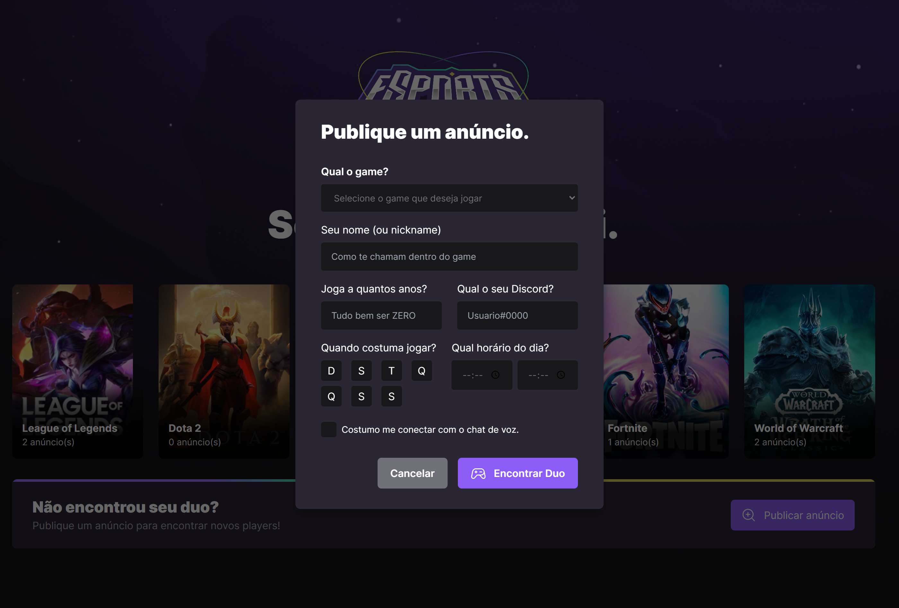

# NLW eSports Ignite 🚀💜🎮

> Trila Ignite

Projeto desenvolvido durante a NLW (Next Level Week) da Rocketseat. Trata-se de uma aplicação web onde é possível criar anúncios de alguns jogos para poder encontrar um duo (parceiro de jogo).

Na aplicação mobile, podemos visualizar os anúncios criados e dar um "match" e jogar juntos.

## Preview Web

- Tela inicial:

- Tela de criação dos anúncios:

## Preview Mobile

- Tela inicial > Visualização dos anúncios > Match!

## 🛠 Tecnologias

- <b>Server</b>: Node, Express, SQLite e Prisma

- <b>Client:</b> React, TailwindCSS

- <b>Mobile:</b> React Native
